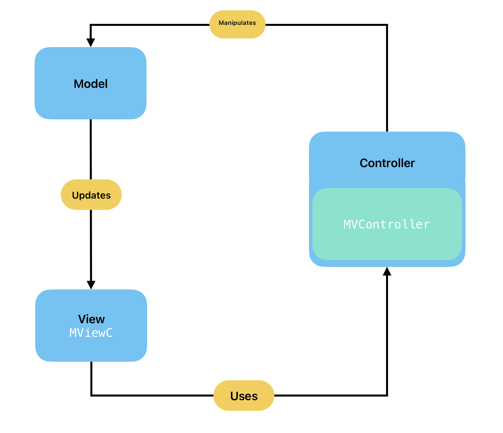

<p align="center">

</p>

# formigas_mvc

Formigas MVC is MVC based state managment library for Flutter.

## Overview

The goal of Formigas MVC is to provide a simple and easy to use state management library for Flutter based on MVC software design pattern. It is a lightweight library that is easy to understand and use.



### Model

The model is the data layer of the application. It is responsible for managing the data of the application. It receives user input from the controller. We recommend to use freezed class to create the model so it will be immutable and easy to manage.
  
```dart
  @freezed
  class ExampleModel with _$ExampleModel {
    const factory ExampleModel({
      required int value,
      required Color color,
    }) = _ExampleModel;
  }
```

### View (`MViewC`)

The view is the UI layer of the application. It is responsible for displaying the data that is received from the controller. In Flutter, the view is represented by a `Widget`. With Formigas MVC, just extend your widget class with `MViewC` so your build method will be triggered everytime when your model will change providing new an updated model. The `MViewC` requires a controller as a parameter so it is accessible to the view and will rebuild the view when the model changes.

 ```dart
   class MViewCExample extends MViewC<ExampleController, ExampleModel> {
  
   const MViewCExample({
     required super.controller,
     super.key,
   });

   @override
   Widget build(BuildContext context, ExampleModel model) => Scaffold(
         appBar: AppBar(
           title: const Text('MViewCExample'),
         ),
         body: Center(
           child: Text('Counter: ${model.value}'),
         ),
         floatingActionButton: FloatingActionButton(
           onPressed: controller.increaseAndShuffleColor,
           backgroundColor: model.color,
           child: const Icon(Icons.plus_one),
         ),
       );
  }
```

### Controller (`MVController`)

The controller is the logic layer of the application. It is responsible for processing the data from the model and updating the view.

```dart
class ExampleController extends MVController<ExampleModel> {
  ExampleController() : super(ExampleModel(value: 0, color: Colors.blue));

  void increaseAndShuffleColor() {
    model = model.copyWith(
      value: model.value + 1,
      color: Colors.primaries[Random().nextInt(Colors.primaries.length)],
    );
  }
}
```

See the example folder for a complete example.
